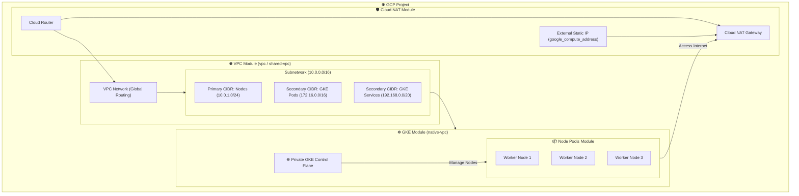

# GCP VPC & GKE Terraform Modules


A collection of production-ready, modular Terraform configurations for provisioning secure, highly-available Virtual Private Clouds (VPC) and private Google Kubernetes Engine (GKE) clusters in Google Cloud Platform (GCP).

---

## 📐 Architecture & Module Topology

The diagram below illustrates how the individual submodules within this repository connect to build a secure VPC network and a private VPC-Native GKE cluster:



---

## 📂 Submodules Overview

* **[vpc/](file://vpc/)**: Configures a basic VPC network with a single custom subnetwork, featuring Private Google Access and secondary IP ranges for GKE.
* **[cloud-nat/](file://cloud-nat/)**: Creates a Cloud NAT Gateway and Cloud Router to grant VMs and GKE worker nodes private egress access to the internet.
* **[native-vpc/](file://native-vpc/)**: Provisions a private, VPC-native Google Kubernetes Engine (GKE) control plane with network policies and authorized networks enabled.
* **[node-pools/](file://node-pools/)**: Manages container node pools with configurable auto-scaling, auto-repair, custom node tags, and custom OAuth scopes.
* **[shared-vpc/](file://shared-vpc/)**: Splitted into `net/` and `subnet/` to provision Host/Service projects structure, implementing GCP Shared VPC corporate pattern.
* **[compute/](file://compute/)**: Simple helper module to reserve static external IP addresses.

---

## 🚀 Usage Example

Here is how you can compose these modules in your root Terraform configuration to provision a secure VPC and GKE cluster:

```terraform
# 1. Provision the VPC Network
module "vpc" {
  source          = "./vpc"
  net_name        = "production-network"
  region          = "us-central1"
  subnet_name     = "gke-subnet"
  subnet_range    = "10.10.10.0/24"
  subnet_pods     = "172.16.0.0/16"
  subnet_services = "192.168.0.0/20"
  enable_flow_logs = "false"
}

# 2. Provision Cloud NAT for Private Egress
module "nat" {
  source                 = "./cloud-nat"
  net_name               = module.vpc.net_link
  subnet_name            = module.vpc.subnet_link
  subnet_range           = module.vpc.subnet_range
  subnet_pods            = module.vpc.subnetwork_pods
  subnet_services        = "192.168.0.0/20"
  region                 = "us-central1"
  enable_flow_logs       = "false"
  nat_ip_allocate_option = "AUTO_ONLY"
}

# 3. Create the Private GKE Cluster Control Plane
module "gke_cluster" {
  source                            = "./native-vpc"
  name                              = "production-gke"
  region                            = "us-central1"
  network_name                      = module.vpc.net_link
  nodes_subnetwork_name             = module.vpc.subnet_link
  pods_secondary_ip_range_name      = module.vpc.gke_pod
  services_secondary_ip_range_name  = module.vpc.gke_service
  kubernetes_version                = "1.27.3-gke.100"
  enable_private_endpoint           = false
  enable_private_nodes              = true
  master_ipv4_cidr_block            = "172.16.255.0/28"
  master_authorized_network_cidrs   = []
}

# 4. Bind Node Pool to GKE Cluster
module "node_pool" {
  source             = "./node-pools"
  name               = "primary-pool"
  region             = "us-central1"
  gke_cluster_name   = module.gke_cluster.name
  machine_type       = "e2-medium"
  initial_node_count = 2
  min_node_count     = 1
  max_node_count     = 5
}
```

---

## 🛡️ CI/CD Validation
This repository has an active GitHub Actions workflow configured in `.github/workflows/validate.yml`. Upon every pull request or push to the `master` branch, it automatically initializes and validates the configuration of all GCP submodules using Terraform version `1.5.7` to ensure syntax compliance.
